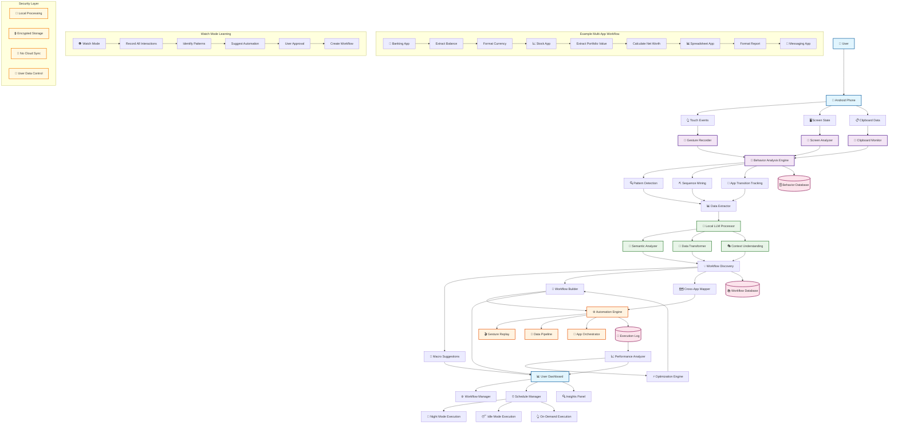

```mermaid
graph TB
    %% User Interaction Layer
    User[👤 User] --> Phone[📱 Android Phone]
    Phone --> TouchEvents[👆 Touch Events]
    Phone --> ScreenState[🖥️ Screen State]
    Phone --> ClipboardData[📋 Clipboard Data]

    %% Core Recording System
    TouchEvents --> GestureRecorder[🎯 Gesture Recorder]
    ScreenState --> ScreenAnalyzer[📸 Screen Analyzer]
    ClipboardData --> ClipboardMonitor[📎 Clipboard Monitor]

    %% Behavioral Analysis Engine
    GestureRecorder --> BehaviorEngine[🧠 Behavior Analysis Engine]
    ScreenAnalyzer --> BehaviorEngine
    ClipboardMonitor --> BehaviorEngine
    
    BehaviorEngine --> PatternDetection[🔍 Pattern Detection]
    BehaviorEngine --> SequenceMining[⛏️ Sequence Mining]
    BehaviorEngine --> AppTransitionTracking[🔄 App Transition Tracking]

    %% Data Intelligence Layer
    PatternDetection --> DataExtractor[📊 Data Extractor]
    SequenceMining --> DataExtractor
    AppTransitionTracking --> DataExtractor
    
    DataExtractor --> LLMProcessor[🤖 Local LLM Processor]
    LLMProcessor --> SemanticAnalyzer[🔬 Semantic Analyzer]
    LLMProcessor --> DataTransformer[🔧 Data Transformer]
    LLMProcessor --> ContextUnderstanding[🎭 Context Understanding]

    %% Workflow Discovery & Management
    SemanticAnalyzer --> WorkflowDiscovery[💡 Workflow Discovery]
    DataTransformer --> WorkflowDiscovery
    ContextUnderstanding --> WorkflowDiscovery
    
    WorkflowDiscovery --> MacroSuggestions[🎯 Macro Suggestions]
    WorkflowDiscovery --> WorkflowBuilder[🔨 Workflow Builder]
    WorkflowDiscovery --> CrossAppMapper[🗺️ Cross-App Mapper]

    %% Automation Execution Engine
    WorkflowBuilder --> AutomationEngine[⚙️ Automation Engine]
    CrossAppMapper --> AutomationEngine
    
    AutomationEngine --> GestureReplay[🎬 Gesture Replay]
    AutomationEngine --> DataPipeline[📏 Data Pipeline]
    AutomationEngine --> AppOrchestrator[🎼 App Orchestrator]

    %% Data Storage & Learning
    BehaviorEngine --> BehaviorDB[(🗄️ Behavior Database)]
    WorkflowDiscovery --> WorkflowDB[(📚 Workflow Database)]
    AutomationEngine --> ExecutionLog[(📝 Execution Log)]
    
    ExecutionLog --> PerformanceAnalyzer[📈 Performance Analyzer]
    PerformanceAnalyzer --> OptimizationEngine[⚡ Optimization Engine]
    OptimizationEngine --> WorkflowBuilder

    %% User Interface & Control
    MacroSuggestions --> UserDashboard[📊 User Dashboard]
    PerformanceAnalyzer --> UserDashboard
    WorkflowBuilder --> UserDashboard
    
    UserDashboard --> WorkflowManager[⚙️ Workflow Manager]
    UserDashboard --> ScheduleManager[⏰ Schedule Manager]
    UserDashboard --> InsightsPanel[🔍 Insights Panel]

    %% Execution Modes
    ScheduleManager --> NightMode[🌙 Night Mode Execution]
    ScheduleManager --> IdleMode[😴 Idle Mode Execution]
    ScheduleManager --> OnDemandMode[👆 On-Demand Execution]

    %% Cross-App Data Flow Example
    subgraph "Example Multi-App Workflow"
        BankApp[🏦 Banking App] --> Extract1[Extract Balance]
        Extract1 --> Transform1[Format Currency]
        Transform1 --> StockApp[📈 Stock App]
        StockApp --> Extract2[Extract Portfolio Value]
        Extract2 --> Calculate[Calculate Net Worth]
        Calculate --> SpreadsheetApp[📊 Spreadsheet App]
        SpreadsheetApp --> Format[Format Report]
        Format --> MessagingApp[💬 Messaging App]
    end

    %% Watch Mode Process
    subgraph "Watch Mode Learning"
        WatchMode[👁️ Watch Mode] --> RecordAll[Record All Interactions]
        RecordAll --> IdentifyPatterns[Identify Patterns]
        IdentifyPatterns --> SuggestAutomation[Suggest Automation]
        SuggestAutomation --> UserApproval[User Approval]
        UserApproval --> CreateWorkflow[Create Workflow]
    end

    %% Security & Privacy
    subgraph "Security Layer"
        LocalProcessing[🔐 Local Processing]
        EncryptedStorage[🔒 Encrypted Storage]
        NoCloudSync[🚫 No Cloud Sync]
        UserDataControl[👤 User Data Control]
    end

    %% Styling
    classDef userLayer fill:#e1f5fe,stroke:#01579b,stroke-width:2px
    classDef coreEngine fill:#f3e5f5,stroke:#4a148c,stroke-width:2px
    classDef aiLayer fill:#e8f5e8,stroke:#2e7d32,stroke-width:2px
    classDef automationLayer fill:#fff3e0,stroke:#e65100,stroke-width:2px
    classDef dataLayer fill:#fce4ec,stroke:#880e4f,stroke-width:2px
    classDef securityLayer fill:#fff8e1,stroke:#f57c00,stroke-width:2px

    class User,Phone,UserDashboard userLayer
    class GestureRecorder,ScreenAnalyzer,ClipboardMonitor,BehaviorEngine coreEngine
    class LLMProcessor,SemanticAnalyzer,DataTransformer,ContextUnderstanding aiLayer
    class AutomationEngine,GestureReplay,DataPipeline,AppOrchestrator automationLayer
    class BehaviorDB,WorkflowDB,ExecutionLog dataLayer
    class LocalProcessing,EncryptedStorage,NoCloudSync,UserDataControl securityLayer
```
