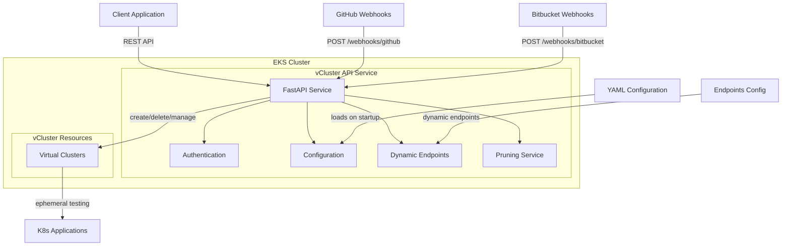
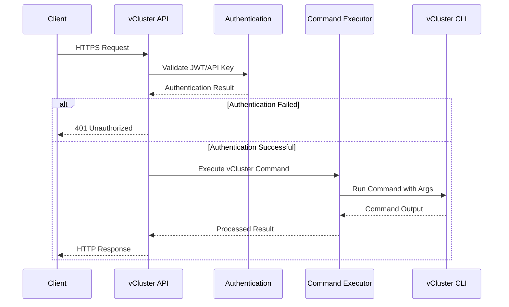
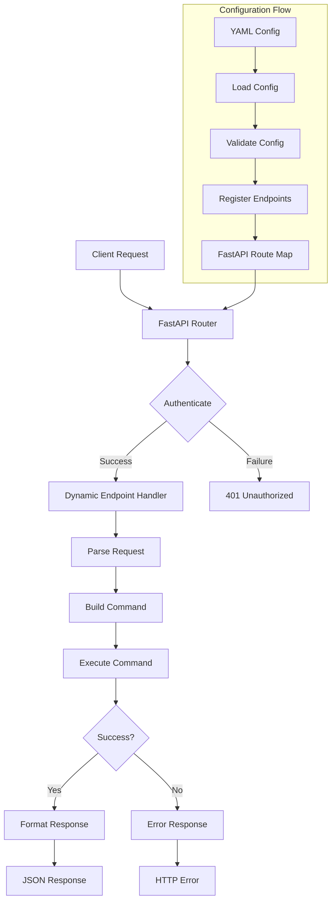
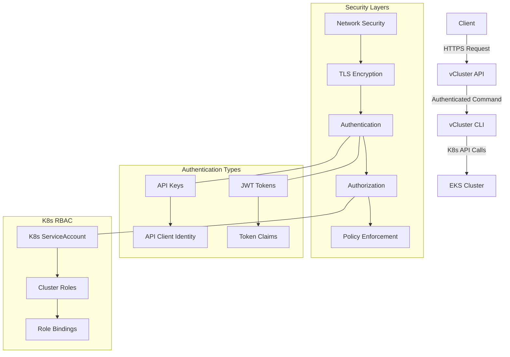

# vCluster API: Complete Solution

This comprehensive solution provides a dynamic, configurable REST API for managing virtual Kubernetes clusters in EKS. The system is designed with security, extensibility, and ease of use in mind.

## System Architecture



## Request Flow



## Complete Solution

Below is the consolidated code for the entire solution:

### Directory Structure

```
vcluster-api/
├── app/
│   ├── __init__.py
│   ├── main.py
│   ├── auth/
│   │   ├── __init__.py
│   │   └── authenticator.py
│   ├── config/
│   │   ├── __init__.py
│   │   └── config.py
│   ├── routers/
│   │   ├── __init__.py
│   │   ├── clusters.py
│   │   ├── webhooks.py
│   │   └── dynamic.py
│   ├── services/
│   │   ├── __init__.py
│   │   ├── cluster_service.py
│   │   └── pruning_service.py
│   └── models/
│       ├── __init__.py
│       └── schemas.py
├── config/
│   ├── config.yaml
│   └── endpoints.yaml
├── k8s/
│   ├── deployment.yaml
│   ├── service.yaml
│   ├── ingress.yaml
│   └── rbac.yaml
├── Dockerfile
└── requirements.txt
```

### 1. Main Application (app/main.py)

```python
from fastapi import FastAPI, Depends, HTTPException, status
from fastapi.middleware.cors import CORSMiddleware
from fastapi.openapi.docs import get_swagger_ui_html
import logging
import os
import uvicorn

from app.config.config import config
from app.auth.authenticator import verify_token, verify_api_key
from app.routers import clusters, webhooks, dynamic
from app.services.pruning_service import setup_pruning_scheduler

# Configure logging
logging_level = logging.DEBUG if config.get("server.debug", False) else logging.INFO
logging.basicConfig(
    level=logging_level,
    format='%(asctime)s - %(name)s - %(levelname)s - %(message)s'
)
logger = logging.getLogger(__name__)

app = FastAPI(
    title="vCluster Manager API",
    description="""
    REST API for managing virtual Kubernetes clusters in EKS.
    
    This API allows you to create, manage, and destroy virtual clusters for CI/CD testing,
    development environments, and multi-tenancy use cases. The API is dynamically
    configurable through YAML files and supports both JWT and API key authentication.
    """,
    version="1.0.0",
)

# CORS configuration
app.add_middleware(
    CORSMiddleware,
    allow_origins=config.get("server.allowed_origins", []),
    allow_credentials=True,
    allow_methods=["*"],
    allow_headers=["*"],
)

# Include routers
app.include_router(clusters.router, prefix="/api/v1")
app.include_router(webhooks.router, prefix="/api/v1")

# Include dynamic endpoints if enabled
if config.get("dynamic_endpoints.enabled", True):
    app.include_router(dynamic.router)
    logger.info("Dynamic endpoints enabled")

@app.on_event("startup")
async def startup_event():
    """Initialize services on application startup"""
    logger.info("Starting vCluster Manager API")
    
    # Setup the scheduler for pruning old clusters
    pruning_interval = config.get("vcluster.pruning_interval_hours", 1)
    setup_pruning_scheduler(pruning_interval)
    
    logger.info(f"API server configured on {config.get('server.host')}:{config.get('server.port')}")

@app.on_event("shutdown")
async def shutdown_event():
    """Clean up resources on application shutdown"""
    logger.info("Shutting down vCluster Manager API")

@app.get("/api/health")
def health_check():
    """Health check endpoint for monitoring and load balancers"""
    return {"status": "healthy"}

@app.get("/api/docs", include_in_schema=False)
async def custom_swagger_ui_html():
    """Custom Swagger UI with authentication headers pre-configured"""
    return get_swagger_ui_html(
        openapi_url=app.openapi_url,
        title=app.title + " - API Documentation",
        swagger_ui_parameters={
            "persistAuthorization": True,
        },
    )

if __name__ == "__main__":
    # Get server configuration from config
    host = config.get("server.host", "0.0.0.0")
    port = int(config.get("server.port", 8000))
    debug = config.get("server.debug", False)
    
    # Run the application
    uvicorn.run("app.main:app", host=host, port=port, reload=debug)
```

### 2. Configuration System (app/config/config.py)

```python
import os
import yaml
import logging
from typing import Dict, Any, List, Optional

logger = logging.getLogger(__name__)

class AppConfig:
    """Configuration manager for the vCluster API service
    
    This class implements a singleton pattern to ensure that the application
    configuration is loaded only once and shared across the application.
    It supports loading configuration from both YAML files and environment
    variables, with environment variables taking precedence.
    """
    
    _instance = None
    
    def __new__(cls):
        """Singleton pattern to ensure only one config instance exists"""
        if cls._instance is None:
            cls._instance = super(AppConfig, cls).__new__(cls)
            cls._instance._load_config()
        return cls._instance
    
    def _load_config(self):
        """Load configuration from YAML file or environment variables"""
        self.config = {}
        
        # Default configuration
        self.config = {
            "server": {
                "host": "0.0.0.0",
                "port": 8000,
                "debug": False,
                "allowed_origins": []
            },
            "auth": {
                "jwt": {
                    "secret_key": "",
                    "algorithm": "HS256",
                    "token_expire_minutes": 30
                },
                "api_keys": {}
            },
            "webhooks": {
                "github": {
                    "enabled": True,
                    "secret": ""
                },
                "bitbucket": {
                    "enabled": True,
                    "secret": ""
                }
            },
            "vcluster": {
                "default_k8s_version": "1.25",
                "default_ttl_hours": 24,
                "pruning_interval_hours": 1,
                "namespace_prefix": ""
            },
            "dynamic_endpoints": {
                "enabled": True,
                "config_path": "config/endpoints.yaml"
            }
        }
        
        # Try to load config from file
        config_path = os.getenv("CONFIG_PATH", "config/config.yaml")
        try:
            if os.path.exists(config_path):
                with open(config_path, 'r') as f:
                    file_config = yaml.safe_load(f)
                    self._merge_config(self.config, file_config)
                logger.info(f"Loaded configuration from {config_path}")
            else:
                logger.warning(f"Config file {config_path} not found, using defaults and environment variables")
        except Exception as e:
            logger.error(f"Error loading config file: {str(e)}")
        
        # Override with environment variables
        self._load_from_env()
        
        # Validate critical configuration
        if not self.config["auth"]["jwt"]["secret_key"]:
            logger.warning("JWT secret key not configured - this is a security risk for production!")
            
    def _merge_config(self, base: Dict[str, Any], override: Dict[str, Any]) -> Dict[str, Any]:
        """Recursively merge configuration dictionaries
        
        Args:
            base: Base configuration dictionary
            override: Override configuration dictionary
            
        Returns:
            Merged configuration dictionary
        """
        for key, value in override.items():
            if key in base and isinstance(base[key], dict) and isinstance(value, dict):
                base[key] = self._merge_config(base[key], value)
            else:
                base[key] = value
        return base
    
    def _load_from_env(self):
        """Load configuration from environment variables
        
        Environment variables take precedence over configuration files.
        This method maps environment variables to configuration values.
        """
        # JWT settings
        if os.getenv("JWT_SECRET_KEY"):
            self.config["auth"]["jwt"]["secret_key"] = os.getenv("JWT_SECRET_KEY")
        if os.getenv("JWT_ALGORITHM"):
            self.config["auth"]["jwt"]["algorithm"] = os.getenv("JWT_ALGORITHM")
        if os.getenv("ACCESS_TOKEN_EXPIRE_MINUTES"):
            self.config["auth"]["jwt"]["token_expire_minutes"] = int(os.getenv("ACCESS_TOKEN_EXPIRE_MINUTES"))
        
        # Webhook secrets
        if os.getenv("GITHUB_WEBHOOK_SECRET"):
            self.config["webhooks"]["github"]["secret"] = os.getenv("GITHUB_WEBHOOK_SECRET")
        if os.getenv("BITBUCKET_WEBHOOK_SECRET"):
            self.config["webhooks"]["bitbucket"]["secret"] = os.getenv("BITBUCKET_WEBHOOK_SECRET")
        
        # Server settings
        if os.getenv("SERVER_HOST"):
            self.config["server"]["host"] = os.getenv("SERVER_HOST")
        if os.getenv("SERVER_PORT"):
            self.config["server"]["port"] = int(os.getenv("SERVER_PORT"))
        if os.getenv("DEBUG") and os.getenv("DEBUG").lower() in ["true", "1", "yes"]:
            self.config["server"]["debug"] = True
        if os.getenv("ALLOWED_ORIGINS"):
            self.config["server"]["allowed_origins"] = os.getenv("ALLOWED_ORIGINS").split(",")
        
        # vCluster settings
        if os.getenv("DEFAULT_K8S_VERSION"):
            self.config["vcluster"]["default_k8s_version"] = os.getenv("DEFAULT_K8S_VERSION")
        if os.getenv("DEFAULT_TTL_HOURS"):
            self.config["vcluster"]["default_ttl_hours"] = int(os.getenv("DEFAULT_TTL_HOURS"))
        if os.getenv("PRUNING_INTERVAL_HOURS"):
            self.config["vcluster"]["pruning_interval_hours"] = int(os.getenv("PRUNING_INTERVAL_HOURS"))
        if os.getenv("NAMESPACE_PREFIX"):
            self.config["vcluster"]["namespace_prefix"] = os.getenv("NAMESPACE_PREFIX")
            
        # Dynamic endpoints settings
        if os.getenv("DYNAMIC_ENDPOINTS") and os.getenv("DYNAMIC_ENDPOINTS").lower() in ["false", "0", "no"]:
            self.config["dynamic_endpoints"]["enabled"] = False
        if os.getenv("ENDPOINTS_CONFIG_PATH"):
            self.config["dynamic_endpoints"]["config_path"] = os.getenv("ENDPOINTS_CONFIG_PATH")
    
    def get(self, path: str, default=None) -> Any:
        """Get a configuration value by dot-separated path
        
        Args:
            path: Dot-separated path to the configuration value
            default: Default value to return if path not found
            
        Returns:
            Configuration value or default
        """
        try:
            result = self.config
            for key in path.split('.'):
                result = result[key]
            return result
        except (KeyError, TypeError):
            return default

# Create singleton instance
config = AppConfig()
```

### 3. Authentication System (app/auth/authenticator.py)

```python
from fastapi import Depends, HTTPException, status, Request
from fastapi.security import OAuth2PasswordBearer, APIKeyHeader
import jwt
from typing import Dict, Optional
import os
from datetime import datetime, timedelta
import logging

from app.config.config import config

logger = logging.getLogger(__name__)

oauth2_scheme = OAuth2PasswordBearer(tokenUrl="token")
api_key_header = APIKeyHeader(name="X-API-Key")

# Get JWT settings from config
JWT_SECRET_KEY = config.get("auth.jwt.secret_key", "")
JWT_ALGORITHM = config.get("auth.jwt.algorithm", "HS256")
ACCESS_TOKEN_EXPIRE_MINUTES = config.get("auth.jwt.token_expire_minutes", 30)

async def verify_token(request: Request) -> Dict:
    """Verify JWT token and return the payload if valid
    
    Args:
        request: FastAPI request object containing the Authorization header
        
    Returns:
        Dict: Token payload if valid
        
    Raises:
        HTTPException: If token is invalid or missing
    """
    # Extract token from Authorization header
    authorization = request.headers.get("Authorization")
    if not authorization:
        raise HTTPException(
            status_code=status.HTTP_401_UNAUTHORIZED,
            detail="Authorization header is missing",
            headers={"WWW-Authenticate": "Bearer"},
        )
        
    try:
        scheme, token = authorization.split()
        if scheme.lower() != "bearer":
            raise HTTPException(
                status_code=status.HTTP_401_UNAUTHORIZED,
                detail="Invalid authentication scheme",
                headers={"WWW-Authenticate": "Bearer"},
            )
    except ValueError:
        raise HTTPException(
            status_code=status.HTTP_401_UNAUTHORIZED,
            detail="Invalid authorization header",
            headers={"WWW-Authenticate": "Bearer"},
        )
    
    try:
        payload = jwt.decode(token, JWT_SECRET_KEY, algorithms=[JWT_ALGORITHM])
        return payload
    except jwt.PyJWTError as e:
        logger.error(f"Token verification failed: {e}")
        raise HTTPException(
            status_code=status.HTTP_401_UNAUTHORIZED,
            detail="Invalid authentication credentials",
            headers={"WWW-Authenticate": "Bearer"},
        )

async def verify_api_key(request: Request) -> Dict:
    """Verify API key and return the associated data if valid
    
    Args:
        request: FastAPI request object containing the X-API-Key header
        
    Returns:
        Dict: API key data if valid
        
    Raises:
        HTTPException: If API key is invalid or missing
    """
    # Extract API key from header
    api_key = request.headers.get("X-API-Key")
    if not api_key:
        raise HTTPException(
            status_code=status.HTTP_401_UNAUTHORIZED,
            detail="API key header is missing"
        )
    
    # Get allowed API keys from config
    api_keys = config.get("auth.api_keys", {})
    
    # Find matching client for this API key
    for client_id, key in api_keys.items():
        if key == api_key:
            return {
                "client_id": client_id,
                "scope": "api"
            }
    
    # No matching API key found
    raise HTTPException(
        status_code=status.HTTP_401_UNAUTHORIZED,
        detail="Invalid API key"
    )

def create_access_token(data: Dict, expires_delta: Optional[timedelta] = None) -> str:
    """Create a new JWT token
    
    Args:
        data: Data to encode in the token
        expires_delta: Optional expiration delta, otherwise config value is used
        
    Returns:
        str: Encoded JWT token
    """
    to_encode = data.copy()
    
    if expires_delta:
        expire = datetime.utcnow() + expires_delta
    else:
        expire = datetime.utcnow() + timedelta(minutes=ACCESS_TOKEN_EXPIRE_MINUTES)
        
    to_encode.update({"exp": expire})
    encoded_jwt = jwt.encode(to_encode, JWT_SECRET_KEY, algorithm=JWT_ALGORITHM)
    
    return encoded_jwt
```

### 4. Cluster Service (app/services/cluster_service.py)

```python
import subprocess
import yaml
import json
import logging
import os
import asyncio
from typing import List, Dict, Optional, Any

from app.models.schemas import ClusterCreate, ClusterResponse
from app.config.config import config

logger = logging.getLogger(__name__)

async def create_cluster(cluster: ClusterCreate, created_by: str) -> ClusterResponse:
    """Create a new vCluster using the vcluster CLI
    
    Args:
        cluster: Cluster configuration
        created_by: User or system that created the cluster
        
    Returns:
        ClusterResponse: Details of the created cluster
        
    Raises:
        Exception: If cluster creation fails
    """
    try:
        # Apply namespace prefix if configured
        namespace_prefix = config.get("vcluster.namespace_prefix", "")
        if namespace_prefix and cluster.namespace:
            # Only add prefix if not already present
            if not cluster.namespace.startswith(namespace_prefix):
                cluster.namespace = f"{namespace_prefix}{cluster.namespace}"
        
        # Prepare command
        cmd = ["vcluster", "create", cluster.name]
        
        # Add namespace if specified
        if cluster.namespace:
            cmd.extend(["--namespace", cluster.namespace])
        
        # Add Kubernetes version if specified, otherwise use default
        k8s_version = cluster.k8s_version or config.get("vcluster.default_k8s_version")
        if k8s_version:
            cmd.extend(["--kubernetes-version", k8s_version])
            
        # Add any custom values
        if cluster.values:
            # Create temporary values file
            values_file = f"/tmp/{cluster.name}-values.yaml"
            with open(values_file, "w") as f:
                yaml.dump(cluster.values, f)
            cmd.extend(["--values", values_file])
            
        # Add labels
        labels = {**cluster.labels, "created-by": created_by}
        for key, value in labels.items():
            cmd.extend(["--label", f"{key}={value}"])
            
        # Add TTL annotation if specified, otherwise use default
        ttl_hours = cluster.ttl_hours or config.get("vcluster.default_ttl_hours")
        if ttl_hours:
            cmd.extend(["--annotation", f"ttl-hours={ttl_hours}"])
        
        # Run the command
        logger.info(f"Running command: {' '.join(cmd)}")
        process = await asyncio.create_subprocess_exec(
            *cmd,
            stdout=asyncio.subprocess.PIPE,
            stderr=asyncio.subprocess.PIPE
        )
        
        stdout, stderr = await process.communicate()
        
        if process.returncode != 0:
            error_msg = stderr.decode().strip()
            logger.error(f"vcluster create failed: {error_msg}")
            raise Exception(f"Failed to create vCluster: {error_msg}")
            
        # Clean up temporary values file if created
        if cluster.values and os.path.exists(values_file):
            os.remove(values_file)
            
        # Get cluster details
        return await get_cluster_details(cluster.name, cluster.namespace)
        
    except Exception as e:
        logger.error(f"Error creating cluster: {str(e)}")
        raise

async def delete_cluster(name: str, namespace: Optional[str] = None) -> None:
    """Delete a vCluster
    
    Args:
        name: Name of the cluster to delete
        namespace: Optional namespace of the cluster
        
    Raises:
        Exception: If cluster deletion fails
    """
    try:
        # Apply namespace prefix if configured
        if namespace:
            namespace_prefix = config.get("vcluster.namespace_prefix", "")
            if namespace_prefix and not namespace.startswith(namespace_prefix):
                namespace = f"{namespace_prefix}{namespace}"
                
        # Prepare command
        cmd = ["vcluster", "delete", name]
        
        # Add namespace if specified
        if namespace:
            cmd.extend(["--namespace", namespace])
            
        # Run the command
        process = await asyncio.create_subprocess_exec(
            *cmd,
            stdout=asyncio.subprocess.PIPE,
            stderr=asyncio.subprocess.PIPE
        )
        
        stdout, stderr = await process.communicate()
        
        if process.returncode != 0:
            error_msg = stderr.decode().strip()
            logger.error(f"vcluster delete failed: {error_msg}")
            raise Exception(f"Failed to delete vCluster: {error_msg}")
            
    except Exception as e:
        logger.error(f"Error deleting cluster: {str(e)}")
        raise

async def list_clusters(namespace: Optional[str] = None) -> List[ClusterResponse]:
    """List all vClusters, optionally filtered by namespace
    
    Args:
        namespace: Optional namespace to filter clusters
        
    Returns:
        List[ClusterResponse]: List of clusters
        
    Raises:
        Exception: If listing clusters fails
    """
    try:
        # Apply namespace prefix if configured
        if namespace:
            namespace_prefix = config.get("vcluster.namespace_prefix", "")
            if namespace_prefix and not namespace.startswith(namespace_prefix):
                namespace = f"{namespace_prefix}{namespace}"
                
        # Prepare command
        cmd = ["vcluster", "list", "-o", "json"]
        
        # Add namespace if specified
        if namespace:
            cmd.extend(["--namespace", namespace])
            
        # Run the command
        process = await asyncio.create_subprocess_exec(
            *cmd,
            stdout=asyncio.subprocess.PIPE,
            stderr=asyncio.subprocess.PIPE
        )
        
        stdout, stderr = await process.communicate()
        
        if process.returncode != 0:
            error_msg = stderr.decode().strip()
            logger.error(f"vcluster list failed: {error_msg}")
            raise Exception(f"Failed to list vClusters: {error_msg}")
            
        # Parse the output
        clusters_data = json.loads(stdout.decode())
        
        # Convert to response model
        clusters = []
        for item in clusters_data:
            cluster = ClusterResponse(
                name=item.get("name", ""),
                namespace=item.get("namespace", ""),
                status=item.get("status", ""),
                created=item.get("created", ""),
                k8s_version=item.get("kubernetes_version", ""),
                kubeconfig=None,  # We don't include kubeconfig in list
                labels=item.get("labels", {}),
            )
            clusters.append(cluster)
            
        return clusters
        
    except Exception as e:
        logger.error(f"Error listing clusters: {str(e)}")
        raise

async def get_cluster_details(name: str, namespace: Optional[str] = None) -> Optional[ClusterResponse]:
    """Get detailed information about a specific vCluster
    
    Args:
        name: Name of the cluster
        namespace: Optional namespace of the cluster
        
    Returns:
        Optional[ClusterResponse]: Cluster details or None if not found
        
    Raises:
        Exception: If getting cluster details fails
    """
    try:
        # Apply namespace prefix if configured
        if namespace:
            namespace_prefix = config.get("vcluster.namespace_prefix", "")
            if namespace_prefix and not namespace.startswith(namespace_prefix):
                namespace = f"{namespace_prefix}{namespace}"
                
        # First check if cluster exists
        clusters = await list_clusters(namespace)
        
        # Find the cluster in the list
        target_cluster = None
        for cluster in clusters:
            if cluster.name == name:
                target_cluster = cluster
                break
                
        if not target_cluster:
            return None
            
        # Get kubeconfig
        cmd = ["vcluster", "connect", name, "--print"]
        
        if namespace:
            cmd.extend(["--namespace", namespace])
            
        process = await asyncio.create_subprocess_exec(
            *cmd,
            stdout=asyncio.subprocess.PIPE,
            stderr=asyncio.subprocess.PIPE
        )
        
        stdout, stderr = await process.communicate()
        
        if process.returncode == 0:
            target_cluster.kubeconfig = stdout.decode()
            
        return target_cluster
        
    except Exception as e:
        logger.error(f"Error getting cluster details: {str(e)}")
        raise
```

### 5. Pruning Service (app/services/pruning_service.py)

```python
from datetime import datetime, timedelta
import logging
import asyncio
import aioschedule as schedule
from typing import List

from app.services.cluster_service import list_clusters, delete_cluster
from app.config.config import config

logger = logging.getLogger(__name__)

async def prune_expired_clusters():
    """Find and delete clusters that have exceeded their TTL
    
    This function is designed to be run periodically to clean up
    expired clusters based on their TTL annotation.
    """
    try:
        logger.info("Starting cluster pruning job")
        
        # Get all clusters
        clusters = await list_clusters()
        
        # Track clusters processed
        processed = 0
        deleted = 0
        
        # Check each cluster for TTL expiration
        for cluster in clusters:
            processed += 1
            
            # Check if the cluster has a TTL annotation
            ttl_hours = cluster.labels.get("ttl-hours")
            if not ttl_hours:
                # Try the annotation directly
                ttl_hours = cluster.labels.get("annotations", {}).get("ttl-hours")
                if not ttl_hours:
                    continue
                
            try:
                ttl_hours = int(ttl_hours)
                
                # Parse creation time
                creation_time = datetime.fromisoformat(cluster.created.replace('Z', '+00:00'))
                
                # Calculate expiry time
                expiry_time = creation_time + timedelta(hours=ttl_hours)
                
                # Check if the cluster has expired
                if datetime.now(tz=expiry_time.tzinfo) > expiry_time:
                    logger.info(f"Deleting expired cluster: {cluster.name} in namespace {cluster.namespace}")
                    await delete_cluster(cluster.name, cluster.namespace)
                    deleted += 1
                else:
                    # Calculate time until expiration
                    time_left = expiry_time - datetime.now(tz=expiry_time.tzinfo)
                    logger.debug(f"Cluster {cluster.name} will expire in {time_left}")
                    
            except (ValueError, TypeError) as e:
                logger.warning(f"Error parsing TTL for cluster {cluster.name}: {str(e)}")
                
        logger.info(f"Finished cluster pruning job. Processed {processed} clusters, deleted {deleted} expired clusters.")
    except Exception as e:
        logger.error(f"Error in pruning job: {str(e)}")

def setup_pruning_scheduler(interval_hours: int = 1):
    """Set up the scheduler for pruning expired clusters
    
    Args:
        interval_hours: How often to run the pruning job (in hours)
    """
    # Run pruning at the specified interval
    schedule.every(interval_hours).hour.do(prune_expired_clusters)
    
    # Start the scheduler in a separate task
    asyncio.create_task(run_scheduler())
    
    logger.info(f"Cluster pruning scheduler set up to run every {interval_hours} hour(s)")

async def run_scheduler():
    """Run the scheduler indefinitely"""
    while True:
        await schedule.run_pending()
        await asyncio.sleep(60)  # Check every minute
```

### 6. Cluster Router (app/routers/clusters.py)

```python
from fastapi import APIRouter, Depends, HTTPException, status, BackgroundTasks, Request, Query
from typing import List, Optional
import logging
import time

from app.auth.authenticator import verify_token, verify_api_key
from app.models.schemas import ClusterCreate, ClusterResponse, ClusterList
from app.services.cluster_service import (
    create_cluster, delete_cluster, list_clusters, get_cluster_details
)
from app.config.config import config

router = APIRouter(
    prefix="/clusters",
    tags=["clusters"],
)

logger = logging.getLogger(__name__)

@router.post("/", response_model=ClusterResponse, status_code=status.HTTP_201_CREATED)
async def create_new_cluster(
    cluster: ClusterCreate,
    background_tasks: BackgroundTasks,
    request: Request,
):
    """Create a new virtual Kubernetes cluster
    
    This endpoint creates a new virtual Kubernetes cluster with the specified configuration.
    The cluster will be created in the background and the response will contain the
    cluster details, including the kubeconfig for accessing the cluster.
    
    The cluster will be automatically deleted after the TTL (time-to-live) expires,
    if specified.
    """
    # Authenticate using JWT or API key
    auth_info = None
    try:
        auth_info = await verify_token(request)
        username = auth_info.get("username", "unknown")
    except HTTPException:
        try:
            auth_info = await verify_api_key(request)
            username = auth_info.get("client_id", "api-client")
        except HTTPException as e:
            raise e
    
    if not auth_info:
        raise HTTPException(
            status_code=status.HTTP_401_UNAUTHORIZED,
            detail="Authentication required"
        )
    
    try:
        start_time = time.time()
        logger.info(f"Creating cluster: {cluster.name} by {username}")
        
        # Set default TTL if not specified
        if cluster.ttl_hours is None:
            cluster.ttl_hours = config.get("vcluster.default_ttl_hours")
        
        result = await create_cluster(cluster, username)
        
        # Log creation time
        creation_time = time.time() - start_time
        logger.info(f"Cluster {cluster.name} created in {creation_time:.2f} seconds")
        
        # Track cluster creation in background
        background_tasks.add_task(
            lambda: logger.info(f"Cluster {cluster.name} creation completed")
        )
        
        return result
    except Exception as e:
        logger.error(f"Failed to create cluster: {str(e)}")
        raise HTTPException(
            status_code=status.HTTP_500_INTERNAL_SERVER_ERROR,
            detail=f"Failed to create cluster: {str(e)}"
        )

@router.get("/", response_model=ClusterList)
async def get_all_clusters(
    namespace: Optional[str] = Query(None, description="Filter clusters by namespace"),
    request: Request = None,
):
    """List all virtual Kubernetes clusters
    
    This endpoint returns a list of all virtual Kubernetes clusters, optionally
    filtered by namespace. The response includes basic information about each
    cluster, but not the kubeconfig.
    """
    # Authenticate using JWT or API key
    try:
        await verify_token(request)
    except HTTPException:
        try:
            await verify_api_key(request)
        except HTTPException as e:
            raise e
    
    try:
        clusters = await list_clusters(namespace)
        return {"clusters": clusters}
    except Exception as e:
        logger.error(f"Failed to list clusters: {str(e)}")
        raise HTTPException(
            status_code=status.HTTP_500_INTERNAL_SERVER_ERROR,
            detail=f"Failed to list clusters: {str(e)}"
        )

@router.get("/{name}", response_model=ClusterResponse)
async def get_cluster(
    name: str,
    namespace: Optional[str] = Query(None, description="Namespace of the cluster"),
    request: Request = None,
):
    """Get details of a specific virtual Kubernetes cluster
    
    This endpoint returns detailed information about a specific virtual Kubernetes
    cluster, including the kubeconfig for accessing the cluster.
    """
    # Authenticate using JWT or API key
    try:
        await verify_token(request)
    except HTTPException:
        try:
            await verify_api_key(request)
        except HTTPException as e:
            raise e
    
    try:
        cluster = await get_cluster_details(name, namespace)
        if not cluster:
            raise HTTPException(
                status_code=status.HTTP_404_NOT_FOUND,
                detail=f"Cluster {name} not found"
            )
        return cluster
    except HTTPException:
        raise
    except Exception as e:
        logger.error(f"Failed to get cluster details: {str(e)}")
        raise HTTPException(
            status_code=status.HTTP_500_INTERNAL_SERVER_ERROR,
            detail=f"Failed to get cluster details: {str(e)}"
        )

@router.delete("/{name}", status_code=status.HTTP_204_NO_CONTENT)
async def remove_cluster(
    name: str,
    namespace: Optional[str] = Query(None, description="Namespace of the cluster"),
    request: Request = None,
):
    """Delete a virtual Kubernetes cluster
    
    This endpoint deletes a specific virtual Kubernetes cluster.
    The operation is irreversible.
    """
    # Authenticate using JWT or API key
    auth_info = None
    try:
        auth_info = await verify_token(request)
        username = auth_info.get("username", "unknown")
    except HTTPException:
        try:
            auth_info = await verify_api_key(request)
            username = auth_info.get("client_id", "api-client")
        except HTTPException as e:
            raise e
    
    if not auth_info:
        raise HTTPException(
            status_code=status.HTTP_401_UNAUTHORIZED,
            detail="Authentication required"
        )
    
    try:
        logger.info(f"Deleting cluster: {name} by {username}")
        await delete_cluster(name, namespace)
        logger.info(f"Deleted cluster: {name}")
        return None
    except Exception as e:
        logger.error(f"Failed to delete cluster: {str(e)}")
        raise HTTPException(
            status_code=status.HTTP_500_INTERNAL_SERVER_ERROR,
            detail=f"Failed to delete cluster: {str(e)}"
        )
```

### 7. Data Models (app/models/schemas.py)

```python
from pydantic import BaseModel, Field, validator
import re
from typing import Dict, List, Optional, Any

class ClusterCreate(BaseModel):
    """Schema for creating a new virtual cluster
    
    Attributes:
        name: Name of the cluster (must be a valid Kubernetes name)
        namespace: Namespace to create the cluster in (must be a valid Kubernetes name)
        k8s_version: Kubernetes version to use (e.g., "1.25")
        values: Custom helm values for the vCluster chart
        labels: Labels to add to the cluster
        ttl_hours: Time-to-live in hours before automatic deletion
    """
    name: str
    namespace: Optional[str] = None
    k8s_version: Optional[str] = None
    values: Optional[Dict[str, Any]] = None
    labels: Dict[str, str] = Field(default_factory=dict)
    ttl_hours: Optional[int] = None
    
    @validator('name')
    def validate_name(cls, v):
        """Validate that the cluster name is a valid Kubernetes name"""
        if not re.match(r'^[a-z0-9]([-a-z0-9]*[a-z0-9])?$', v):
            raise ValueError('Cluster name must be a valid Kubernetes name (lowercase, alphanumeric, hyphens)')
        return v
    
    @validator('namespace')
    def validate_namespace(cls, v):
        """Validate that the namespace is a valid Kubernetes name if provided"""
        if v and not re.match(r'^[a-z0-9]([-a-z0-9]*[a-z0-9])?$', v):
            raise ValueError('Namespace must be a valid Kubernetes name (lowercase, alphanumeric, hyphens)')
        return v
    
    @validator('ttl_hours')
    def validate_ttl(cls, v):
        """Validate that the TTL is a positive number if provided"""
        if v is not None and v <= 0:
            raise ValueError('TTL must be a positive number')
        return v

class ClusterResponse(BaseModel):
    """Schema for virtual cluster response
    
    Attributes:
        name: Name of the cluster
        namespace: Namespace the cluster is in
        status: Current status of the cluster
        created: Creation timestamp
        k8s_version: Kubernetes version
        kubeconfig: Kubeconfig for accessing the cluster
        labels: Labels attached to the cluster
    """
    name: str
    namespace: str
    status: str
    created: str
    k8s_version: str
    kubeconfig: Optional[str] = None
    labels: Dict[str, str] = Field(default_factory=dict)

class ClusterList(BaseModel):
    """Schema for list of virtual clusters
    
    Attributes:
        clusters: List of clusters
    """
    clusters: List[ClusterResponse]

class TokenRequest(BaseModel):
    """Schema for requesting a JWT token
    
    Attributes:
        username: Username for the token
        password: Password for authentication
    """
    username: str
    password: str

class TokenResponse(BaseModel):
    """Schema for JWT token response
    
    Attributes:
        access_token: JWT access token
        token_type: Type of token (always "bearer")
        expires_in: Expiration time in seconds
    """
    access_token: str
    token_type: str = "bearer"
    expires_in: int
```

### 8. Kubernetes Deployment Resources (k8s/deployment.yaml)

```yaml
apiVersion: apps/v1
kind: Deployment
metadata:
  name: vcluster-api
  namespace: vcluster-system
  labels:
    app: vcluster-api
spec:
  replicas: 2
  selector:
    matchLabels:
      app: vcluster-api
  template:
    metadata:
      labels:
        app: vcluster-api
    spec:
      serviceAccountName: vcluster-api-sa
      containers:
      - name: vcluster-api
        image: your-registry/vcluster-api:latest
        imagePullPolicy: Always
        ports:
        - containerPort: 8000
          name: http
        env:
        - name: JWT_SECRET_KEY
          valueFrom:
            secretKeyRef:
              name: vcluster-api-secrets
              key: jwt-secret
        - name: GITHUB_WEBHOOK_SECRET
          valueFrom:
            secretKeyRef:
              name: vcluster-api-secrets
              key: github-webhook-secret
              optional: true
        - name: BITBUCKET_WEBHOOK_SECRET
          valueFrom:
            secretKeyRef:
              name: vcluster-api-secrets
              key: bitbucket-webhook-secret
              optional: true
        - name: ALLOWED_ORIGINS
          value: "https://portal.example.com"
        - name: CONFIG_PATH
          value: "/app/config/config.yaml"
        - name: ENDPOINTS_CONFIG_PATH
          value: "/app/config/endpoints.yaml"
        - name: NAMESPACE_PREFIX
          value: "vc-"  # Optional prefix for all namespaces
        volumeMounts:
        - name: config-volume
          mountPath: /app/config
        resources:
          requests:
            cpu: 200m
            memory: 256Mi
          limits:
            cpu: 1
            memory: 1Gi
        livenessProbe:
          httpGet:
            path: /api/health
            port: http
          initialDelaySeconds: 30
          periodSeconds: 10
        readinessProbe:
          httpGet:
            path: /api/health
            port: http
          initialDelaySeconds: 5
          periodSeconds: 5
      volumes:
      - name: config-volume
        configMap:
          name: vcluster-api-config
```

### 9. Dockerfile (for building the container)

```dockerfile
FROM python:3.10-slim

WORKDIR /app

# Install dependencies
RUN apt-get update && apt-get install -y curl && \
    apt-get clean && \
    rm -rf /var/lib/apt/lists/*

# Install vcluster CLI
RUN curl -L -o vcluster "https://github.com/loft-sh/vcluster/releases/latest/download/vcluster-linux-amd64" && \
    install -c -m 0755 vcluster /usr/local/bin && \
    rm -f vcluster

# Install kubectl
RUN curl -LO "https://dl.k8s.io/release/$(curl -L -s https://dl.k8s.io/release/stable.txt)/bin/linux/amd64/kubectl" && \
    install -c -m 0755 kubectl /usr/local/bin && \
    rm -f kubectl

# Copy requirements file
COPY requirements.txt .

# Install Python dependencies
RUN pip install --no-cache-dir -r requirements.txt

# Copy application code
COPY app/ ./app/

# Create config directory
RUN mkdir -p /app/config

# Set default configuration files
COPY config/config.yaml /app/config/config.yaml
COPY config/endpoints.yaml /app/config/endpoints.yaml

# Run the application
CMD ["python", "-m", "app.main"]
```

### 10. Requirements File (requirements.txt)

```
fastapi==0.103.1
uvicorn==0.23.2
pyjwt==2.8.0
pyyaml==6.0.1
aioschedule==0.5.2
pydantic==2.3.0
python-multipart==0.0.6
```

## Configuration Examples

### Main Configuration File (config/config.yaml)

```yaml
# vCluster API Configuration
server:
  host: 0.0.0.0
  port: 8000
  debug: false
  allowed_origins:
    - https://portal.example.com
    - https://dev-portal.example.com

auth:
  jwt:
    # JWT secret key should be set via environment variable for security
    algorithm: HS256
    token_expire_minutes: 60
  api_keys:
    # These should be set via environment variable or Kubernetes secrets in production
    ci-system: aaf4c61ddcc5e8a2dabede0f3b482cd9aea9434d
    monitoring: 7d793037a0760186574b0282f2f435e7

webhooks:
  github:
    enabled: true
  bitbucket:
    enabled: true

vcluster:
  # Default Kubernetes version for new clusters
  default_k8s_version: "1.25"
  # Default time-to-live in hours before clusters are automatically deleted
  default_ttl_hours: 24
  # How often to run the pruning job (in hours)
  pruning_interval_hours: 1
  # Optional prefix for all namespaces
  namespace_prefix: "vc-"

dynamic_endpoints:
  enabled: true
  config_path: "/app/config/endpoints.yaml"
```

## Client Usage Examples

### Creating a Cluster (Python Client)

```python
import requests
import json
import jwt
import time
from datetime import datetime, timedelta

# API configuration
API_URL = "https://vcluster-api.example.com/api/v1"

# Authentication options (choose one)
# Option 1: JWT token
def get_jwt_token(username='admin', secret='your-jwt-secret'):
    payload = {
        "username": username,
        "scope": "admin",
        "exp": datetime.utcnow() + timedelta(minutes=60)
    }
    token = jwt.encode(payload, secret, algorithm="HS256")
    return token

# Option 2: API key
API_KEY = "your-api-key"

# Choose authentication method
auth_headers = {"Authorization": f"Bearer {get_jwt_token()}"}
# OR
# auth_headers = {"X-API-Key": API_KEY}

# Create a cluster
def create_cluster(name, namespace=None, k8s_version=None, ttl_hours=None):
    url = f"{API_URL}/clusters/"
    
    data = {
        "name": name,
        "namespace": namespace or name,
        "k8s_version": k8s_version or "1.25",
        "ttl_hours": ttl_hours or 24,
        "labels": {
            "purpose": "testing",
            "team": "platform",
            "environment": "dev"
        }
    }
    
    response = requests.post(url, headers=auth_headers, json=data)
    
    if response.status_code == 201:
        print(f"Cluster {name} created successfully!")
        cluster_data = response.json()
        
        # Save kubeconfig to file if present
        if "kubeconfig" in cluster_data and cluster_data["kubeconfig"]:
            with open(f"{name}-kubeconfig.yaml", "w") as f:
                f.write(cluster_data["kubeconfig"])
            print(f"Kubeconfig saved to {name}-kubeconfig.yaml")
            
        return cluster_data
    else:
        print(f"Failed to create cluster: {response.status_code} - {response.text}")
        return None

# List all clusters
def list_clusters(namespace=None):
    url = f"{API_URL}/clusters/"
    if namespace:
        url += f"?namespace={namespace}"
        
    response = requests.get(url, headers=auth_headers)
    
    if response.status_code == 200:
        clusters = response.json()["clusters"]
        print(f"Found {len(clusters)} clusters")
        for cluster in clusters:
            print(f"  {cluster['name']} in {cluster['namespace']} - {cluster['status']}")
        return clusters
    else:
        print(f"Failed to list clusters: {response.status_code} - {response.text}")
        return []

# Get a specific cluster
def get_cluster(name, namespace=None):
    url = f"{API_URL}/clusters/{name}"
    if namespace:
        url += f"?namespace={namespace}"
        
    response = requests.get(url, headers=auth_headers)
    
    if response.status_code == 200:
        return response.json()
    else:
        print(f"Failed to get cluster: {response.status_code} - {response.text}")
        return None

# Delete a cluster
def delete_cluster(name, namespace=None):
    url = f"{API_URL}/clusters/{name}"
    if namespace:
        url += f"?namespace={namespace}"
        
    response = requests.delete(url, headers=auth_headers)
    
    if response.status_code == 204:
        print(f"Cluster {name} deleted successfully")
        return True
    else:
        print(f"Failed to delete cluster: {response.status_code} - {response.text}")
        return False

# Example usage
if __name__ == "__main__":
    # Create a new cluster
    cluster = create_cluster("test-cluster", ttl_hours=48)
    
    # Wait for a moment to let the cluster initialize
    time.sleep(5)
    
    # List all clusters
    list_clusters()
    
    # Get details of a specific cluster
    cluster_details = get_cluster("test-cluster")
    if cluster_details:
        print(f"Status: {cluster_details['status']}")
    
    # Delete the cluster when done
    # delete_cluster("test-cluster")
```

## Dynamic Endpoints Configuration and Flow



## Security Model



This comprehensive solution provides a powerful, secure, and extensible API for managing virtual Kubernetes clusters in EKS. The design follows best practices for Kubernetes applications, with proper configuration, authentication, and extensibility built in.

The system is highly configurable through YAML files and environment variables, making it easy to adapt to different environments and requirements. Dynamic endpoint functionality allows adding new API endpoints without modifying the code, making it adaptable to future requirements.