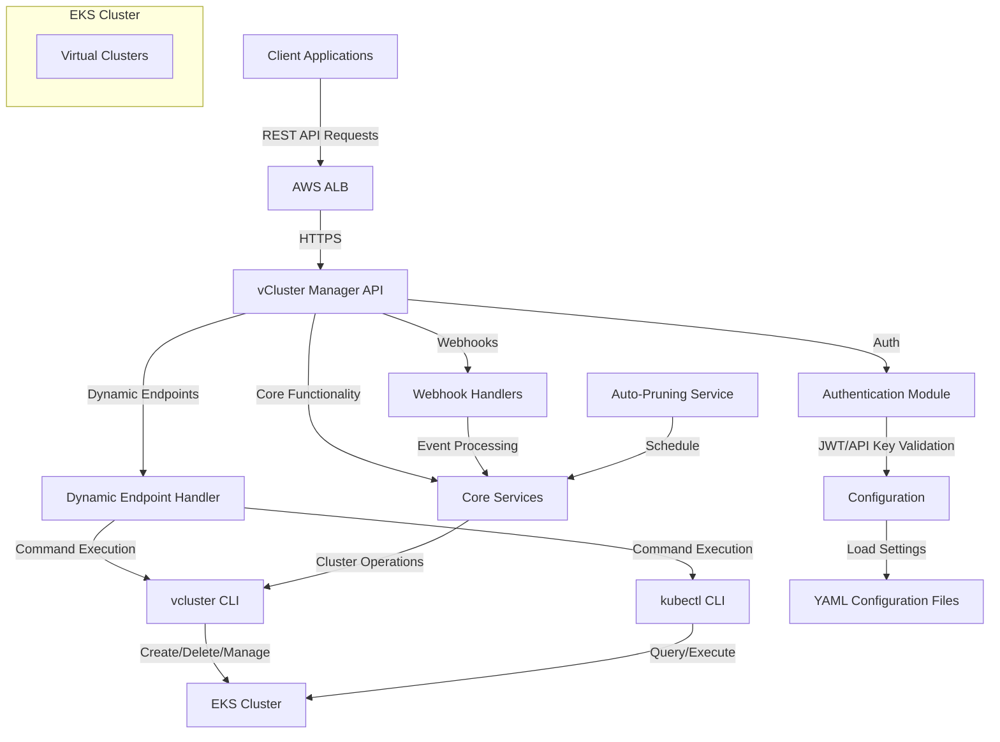
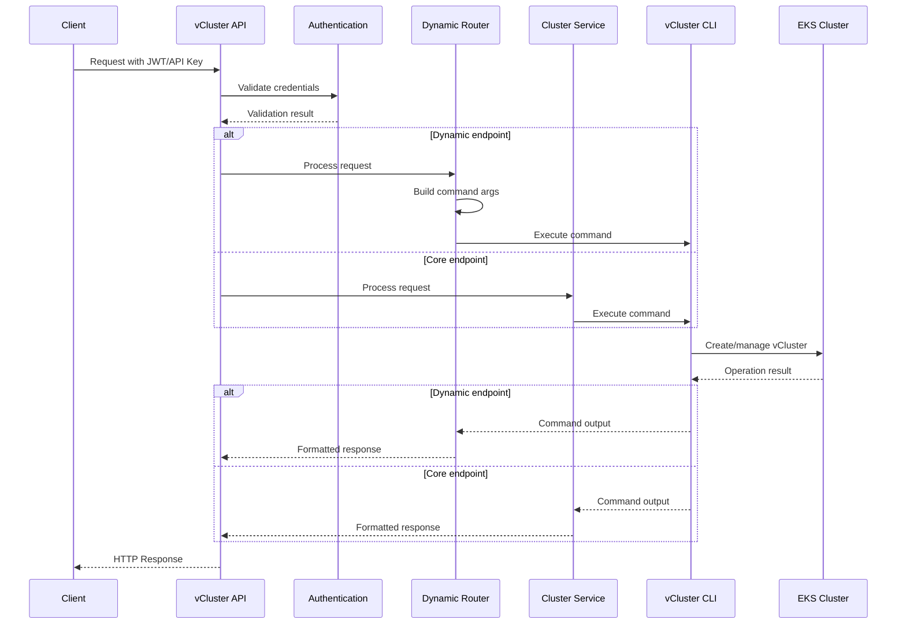

# vCluster Manager API: Complete Solution

The vCluster Manager API is a comprehensive solution for creating, managing, and destroying virtual Kubernetes clusters within an EKS environment. This document provides a complete overview of the system architecture, implementation details, and usage instructions.

## System Architecture



## Component Interactions



## Project Structure

```mermaid
graph TD
    App[vcluster-api/] --> AppDir[app/]
    App --> Config[config/]
    App --> K8s[k8s/]
    App --> Docker[Dockerfile]
    App --> Req[requirements.txt]
    
    AppDir --> Main[main.py]
    AppDir --> Init[__init__.py]
    
    AppDir --> Auth[auth/]
    AppDir --> Routers[routers/]
    AppDir --> Services[services/]
    AppDir --> Models[models/]
    AppDir --> Config2[config/]
    
    Auth --> AuthInit[__init__.py]
    Auth --> Authenticator[authenticator.py]
    
    Routers --> RouterInit[__init__.py]
    Routers --> Clusters[clusters.py]
    Routers --> Webhooks[webhooks.py]
    Routers --> Dynamic[dynamic.py]
    
    Services --> ServiceInit[__init__.py]
    Services --> ClusterService[cluster_service.py]
    Services --> PruningService[pruning_service.py]
    
    Models --> ModelsInit[__init__.py]
    Models --> Schemas[schemas.py]
    
    Config2 --> ConfigInit[__init__.py]
    Config2 --> ConfigModule[config.py]
    
    Config --> ConfigYaml[config.yaml]
    Config --> Endpoints[endpoints.yaml]
    
    K8s --> Deployment[deployment.yaml]
    K8s --> Service[service.yaml]
    K8s --> Ingress[ingress.yaml]
    K8s --> RBAC[rbac.yaml]
```



## Complete Implementation

Below is the complete implementation of the vCluster Manager API:

### Directory Structure

```
vcluster-api/
├── app/
│   ├── __init__.py
│   ├── main.py
│   ├── auth/
│   │   ├── __init__.py
│   │   └── authenticator.py
│   ├── routers/
│   │   ├── __init__.py
│   │   ├── clusters.py
│   │   ├── webhooks.py
│   │   └── dynamic.py
│   ├── services/
│   │   ├── __init__.py
│   │   ├── cluster_service.py
│   │   └── pruning_service.py
│   ├── models/
│   │   ├── __init__.py
│   │   └── schemas.py
│   └── config/
│       ├── __init__.py
│       └── config.py
├── config/
│   ├── config.yaml
│   └── endpoints.yaml
├── k8s/
│   ├── deployment.yaml
│   ├── service.yaml
│   ├── ingress.yaml
│   └── rbac.yaml
├── Dockerfile
└── requirements.txt
```

### 1. Main Application (app/main.py)

```python
from fastapi import FastAPI, Depends, HTTPException, status, Request
from fastapi.middleware.cors import CORSMiddleware
from fastapi.responses import JSONResponse
import logging
import uvicorn
import os

from app.config.config import config
from app.auth.authenticator import verify_token, verify_api_key
from app.routers import clusters, webhooks, dynamic
from app.services.pruning_service import setup_pruning_scheduler

# Configure logging
logging_level = logging.DEBUG if config.get("server.debug", False) else logging.INFO
logging.basicConfig(
    level=logging_level,
    format='%(asctime)s - %(name)s - %(levelname)s - %(message)s'
)
logger = logging.getLogger(__name__)

# Create FastAPI application
app = FastAPI(
    title="vCluster Manager API",
    description="""
    REST API for managing virtual Kubernetes clusters in EKS.
    
    This API allows you to create, manage, and destroy virtual clusters for CI/CD testing,
    development environments, and multi-tenancy scenarios.
    """,
    version="1.0.0"
)

# Add CORS middleware
app.add_middleware(
    CORSMiddleware,
    allow_origins=config.get("server.allowed_origins", []),
    allow_credentials=True,
    allow_methods=["*"],
    allow_headers=["*"],
)

# Include routers
app.include_router(clusters.router)
app.include_router(webhooks.router)
app.include_router(dynamic.router)

# Error handlers
@app.exception_handler(Exception)
async def generic_exception_handler(request: Request, exc: Exception):
    logger.error(f"Unhandled exception: {str(exc)}")
    return JSONResponse(
        status_code=status.HTTP_500_INTERNAL_SERVER_ERROR,
        content={"detail": "Internal server error"},
    )

# Startup and shutdown events
@app.on_event("startup")
async def startup_event():
    logger.info("Starting vCluster Manager API")
    # Setup the scheduler for pruning old clusters
    setup_pruning_scheduler()

@app.on_event("shutdown")
async def shutdown_event():
    logger.info("Shutting down vCluster Manager API")

# Health check endpoint
@app.get("/health")
async def health_check():
    return {"status": "healthy"}

# API information endpoint
@app.get("/api/info")
async def api_info():
    return {
        "name": "vCluster Manager API",
        "version": "1.0.0",
        "description": "REST API for managing virtual Kubernetes clusters in EKS",
        "dynamic_endpoints_enabled": config.get("dynamic_endpoints.enabled", True),
        "webhooks_enabled": {
            "github": config.get("webhooks.github.enabled", True),
            "bitbucket": config.get("webhooks.bitbucket.enabled", True),
        }
    }

# Run the application if executed directly
if __name__ == "__main__":
    host = config.get("server.host", "0.0.0.0")
    port = int(config.get("server.port", 8000))
    debug = config.get("server.debug", False)
    
    logger.info(f"Starting server on {host}:{port}, debug={debug}")
    uvicorn.run("app.main:app", host=host, port=port, reload=debug)
```

### 2. Configuration Module (app/config/config.py)

```python
import os
import yaml
import logging
from typing import Dict, Any, List, Optional

logger = logging.getLogger(__name__)

class AppConfig:
    """Configuration manager for the vCluster API service"""
    
    _instance = None
    
    def __new__(cls):
        """Singleton pattern to ensure only one config instance exists"""
        if cls._instance is None:
            cls._instance = super(AppConfig, cls).__new__(cls)
            cls._instance._load_config()
        return cls._instance
    
    def _load_config(self):
        """Load configuration from YAML file or environment variables"""
        self.config = {}
        
        # Default configuration
        self.config = {
            "server": {
                "host": "0.0.0.0",
                "port": 8000,
                "debug": False,
                "allowed_origins": []
            },
            "auth": {
                "jwt": {
                    "secret_key": "",
                    "algorithm": "HS256",
                    "token_expire_minutes": 30
                },
                "api_keys": {}
            },
            "webhooks": {
                "github": {
                    "enabled": True,
                    "secret": ""
                },
                "bitbucket": {
                    "enabled": True,
                    "secret": ""
                }
            },
            "vcluster": {
                "default_k8s_version": "1.25",
                "default_ttl_hours": 24,
                "pruning_interval_hours": 1,
                "namespace_prefix": ""
            },
            "dynamic_endpoints": {
                "enabled": True,
                "config_path": "endpoints.yaml"
            }
        }
        
        # Try to load config from file
        config_path = os.getenv("CONFIG_PATH", "/app/config/config.yaml")
        try:
            if os.path.exists(config_path):
                with open(config_path, 'r') as f:
                    file_config = yaml.safe_load(f)
                    self._merge_config(self.config, file_config)
                logger.info(f"Loaded configuration from {config_path}")
            else:
                logger.warning(f"Config file {config_path} not found, using defaults and environment variables")
        except Exception as e:
            logger.error(f"Error loading config file: {str(e)}")
        
        # Override with environment variables
        self._load_from_env()
        
    def _merge_config(self, base: Dict[str, Any], override: Dict[str, Any]) -> Dict[str, Any]:
        """Recursively merge configuration dictionaries"""
        for key, value in override.items():
            if key in base and isinstance(base[key], dict) and isinstance(value, dict):
                base[key] = self._merge_config(base[key], value)
            else:
                base[key] = value
        return base
    
    def _load_from_env(self):
        """Load configuration from environment variables"""
        # JWT settings
        if os.getenv("JWT_SECRET_KEY"):
            self.config["auth"]["jwt"]["secret_key"] = os.getenv("JWT_SECRET_KEY")
        if os.getenv("JWT_ALGORITHM"):
            self.config["auth"]["jwt"]["algorithm"] = os.getenv("JWT_ALGORITHM")
        if os.getenv("ACCESS_TOKEN_EXPIRE_MINUTES"):
            self.config["auth"]["jwt"]["token_expire_minutes"] = int(os.getenv("ACCESS_TOKEN_EXPIRE_MINUTES"))
        
        # Webhook secrets
        if os.getenv("GITHUB_WEBHOOK_SECRET"):
            self.config["webhooks"]["github"]["secret"] = os.getenv("GITHUB_WEBHOOK_SECRET")
        if os.getenv("BITBUCKET_WEBHOOK_SECRET"):
            self.config["webhooks"]["bitbucket"]["secret"] = os.getenv("BITBUCKET_WEBHOOK_SECRET")
        
        # Server settings
        if os.getenv("SERVER_HOST"):
            self.config["server"]["host"] = os.getenv("SERVER_HOST")
        if os.getenv("SERVER_PORT"):
            self.config["server"]["port"] = int(os.getenv("SERVER_PORT"))
        if os.getenv("DEBUG") and os.getenv("DEBUG").lower() in ["true", "1", "yes"]:
            self.config["server"]["debug"] = True
        if os.getenv("ALLOWED_ORIGINS"):
            self.config["server"]["allowed_origins"] = os.getenv("ALLOWED_ORIGINS").split(",")
        
        # vCluster settings
        if os.getenv("DEFAULT_K8S_VERSION"):
            self.config["vcluster"]["default_k8s_version"] = os.getenv("DEFAULT_K8S_VERSION")
        if os.getenv("DEFAULT_TTL_HOURS"):
            self.config["vcluster"]["default_ttl_hours"] = int(os.getenv("DEFAULT_TTL_HOURS"))
        if os.getenv("PRUNING_INTERVAL_HOURS"):
            self.config["vcluster"]["pruning_interval_hours"] = int(os.getenv("PRUNING_INTERVAL_HOURS"))
        if os.getenv("NAMESPACE_PREFIX"):
            self.config["vcluster"]["namespace_prefix"] = os.getenv("NAMESPACE_PREFIX")
    
    def get(self, path: str, default=None) -> Any:
        """Get a configuration value by dot-separated path"""
        try:
            result = self.config
            for key in path.split('.'):
                result = result[key]
            return result
        except (KeyError, TypeError):
            return default

# Create singleton instance
config = AppConfig()
```

### 3. Authentication Module (app/auth/authenticator.py)

```python
from fastapi import Depends, HTTPException, status, Request
from fastapi.security import OAuth2PasswordBearer, APIKeyHeader
import jwt
from typing import Dict, Optional
import os
from datetime import datetime, timedelta
import logging

from app.config.config import config

logger = logging.getLogger(__name__)

oauth2_scheme = OAuth2PasswordBearer(tokenUrl="token")
api_key_header = APIKeyHeader(name="X-API-Key")

# Get JWT settings from config
JWT_SECRET_KEY = config.get("auth.jwt.secret_key", "")
JWT_ALGORITHM = config.get("auth.jwt.algorithm", "HS256")
ACCESS_TOKEN_EXPIRE_MINUTES = config.get("auth.jwt.token_expire_minutes", 30)

async def verify_token(request: Request) -> Dict:
    """Verify JWT token and return the payload if valid"""
    # Extract token from Authorization header
    authorization = request.headers.get("Authorization")
    if not authorization:
        raise HTTPException(
            status_code=status.HTTP_401_UNAUTHORIZED,
            detail="Authorization header is missing",
            headers={"WWW-Authenticate": "Bearer"},
        )
        
    try:
        scheme, token = authorization.split()
        if scheme.lower() != "bearer":
            raise HTTPException(
                status_code=status.HTTP_401_UNAUTHORIZED,
                detail="Invalid authentication scheme",
                headers={"WWW-Authenticate": "Bearer"},
            )
    except ValueError:
        raise HTTPException(
            status_code=status.HTTP_401_UNAUTHORIZED,
            detail="Invalid authorization header",
            headers={"WWW-Authenticate": "Bearer"},
        )
    
    try:
        payload = jwt.decode(token, JWT_SECRET_KEY, algorithms=[JWT_ALGORITHM])
        return payload
    except jwt.PyJWTError as e:
        logger.error(f"Token verification failed: {e}")
        raise HTTPException(
            status_code=status.HTTP_401_UNAUTHORIZED,
            detail="Invalid authentication credentials",
            headers={"WWW-Authenticate": "Bearer"},
        )

async def verify_api_key(request: Request) -> Dict:
    """Verify API key and return the associated data if valid"""
    # Extract API key from header
    api_key = request.headers.get("X-API-Key")
    if not api_key:
        raise HTTPException(
            status_code=status.HTTP_401_UNAUTHORIZED,
            detail="API key header is missing"
        )
    
    # Get allowed API keys from config
    api_keys = config.get("auth.api_keys", {})
    
    # Find matching client for this API key
    for client_id, key in api_keys.items():
        if key == api_key:
            return {
                "client_id": client_id,
                "scope": "api"
            }
    
    # No matching API key found
    raise HTTPException(
        status_code=status.HTTP_401_UNAUTHORIZED,
        detail="Invalid API key"
    )

def create_access_token(data: Dict, expires_delta: Optional[timedelta] = None) -> str:
    """Create a new JWT token"""
    to_encode = data.copy()
    
    if expires_delta:
        expire = datetime.utcnow() + expires_delta
    else:
        expire = datetime.utcnow() + timedelta(minutes=ACCESS_TOKEN_EXPIRE_MINUTES)
        
    to_encode.update({"exp": expire})
    encoded_jwt = jwt.encode(to_encode, JWT_SECRET_KEY, algorithm=JWT_ALGORITHM)
    
    return encoded_jwt

# Authentication endpoint to generate tokens
async def generate_token(username: str, password: str) -> Dict:
    """Generate JWT token for valid credentials"""
    # This is a simplified example - in production, implement proper user authentication
    # against a database or external auth system
    if username == "admin" and password == "admin_password":  # Example only!
        token_data = {
            "sub": username,
            "username": username,
            "scope": "admin"
        }
        access_token = create_access_token(token_data)
        return {
            "access_token": access_token,
            "token_type": "bearer"
        }
    else:
        raise HTTPException(
            status_code=status.HTTP_401_UNAUTHORIZED,
            detail="Incorrect username or password"
        )
```

### 4. Data Models (app/models/schemas.py)

```python
from pydantic import BaseModel, Field, validator
from typing import Dict, List, Optional, Any
import re

class ClusterCreate(BaseModel):
    """Schema for creating a new vCluster"""
    name: str
    namespace: Optional[str] = None
    k8s_version: Optional[str] = None
    values: Optional[Dict[str, Any]] = None
    labels: Dict[str, str] = Field(default_factory=dict)
    ttl_hours: Optional[int] = None
    
    @validator('name')
    def validate_name(cls, v):
        if not re.match(r'^[a-z0-9]([-a-z0-9]*[a-z0-9])?$', v):
            raise ValueError('Name must consist of lowercase alphanumeric characters or "-", and must start and end with an alphanumeric character')
        return v
    
    @validator('namespace')
    def validate_namespace(cls, v):
        if v is not None and not re.match(r'^[a-z0-9]([-a-z0-9]*[a-z0-9])?$', v):
            raise ValueError('Namespace must consist of lowercase alphanumeric characters or "-", and must start and end with an alphanumeric character')
        return v
    
    @validator('ttl_hours')
    def validate_ttl(cls, v):
        if v is not None and (v < 1 or v > 720):
            raise ValueError('TTL must be between 1 and 720 hours (30 days)')
        return v

class ClusterResponse(BaseModel):
    """Schema for vCluster response"""
    name: str
    namespace: str
    status: str
    created: str
    k8s_version: str
    kubeconfig: Optional[str] = None
    labels: Dict[str, str] = Field(default_factory=dict)

class ClusterList(BaseModel):
    """Schema for list of vClusters"""
    clusters: List[ClusterResponse]

class TokenRequest(BaseModel):
    """Schema for token request"""
    username: str
    password: str

class TokenResponse(BaseModel):
    """Schema for token response"""
    access_token: str
    token_type: str

class WebhookEvent(BaseModel):
    """Schema for webhook event"""
    event_type: str
    payload: Dict[str, Any]
```

### 5. Cluster Service (app/services/cluster_service.py)

```python
import subprocess
import yaml
import json
import logging
import os
import asyncio
from datetime import datetime
from typing import List, Dict, Optional, Any

from app.models.schemas import ClusterCreate, ClusterResponse
from app.config.config import config

logger = logging.getLogger(__name__)

# Add namespace prefix if configured
def get_namespace(namespace: Optional[str]) -> Optional[str]:
    """Get namespace with prefix if configured"""
    if not namespace:
        return namespace
        
    prefix = config.get("vcluster.namespace_prefix", "")
    if prefix and not namespace.startswith(prefix):
        return f"{prefix}{namespace}"
    return namespace

async def create_cluster(cluster: ClusterCreate, created_by: str) -> ClusterResponse:
    """Create a new vCluster using the vcluster CLI"""
    try:
        # Apply namespace prefix if configured
        namespace = get_namespace(cluster.namespace)
        
        # Prepare command
        cmd = ["vcluster", "create", cluster.name]
        
        # Add namespace if specified
        if namespace:
            cmd.extend(["--namespace", namespace])
        
        # Add Kubernetes version if specified
        if cluster.k8s_version:
            cmd.extend(["--kubernetes-version", cluster.k8s_version])
        elif config.get("vcluster.default_k8s_version"):
            cmd.extend(["--kubernetes-version", config.get("vcluster.default_k8s_version")])
            
        # Add any custom values
        if cluster

